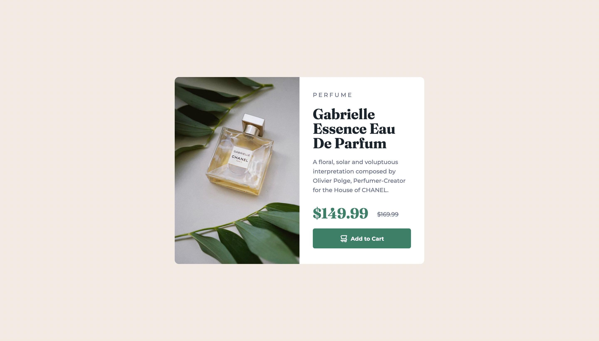
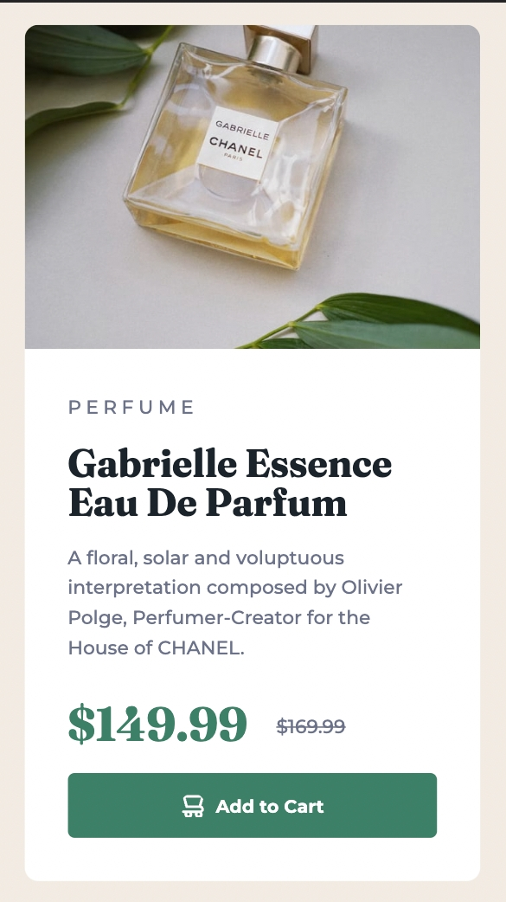

# Frontend Mentor - Product preview card component solution

This is a solution to the [Product preview card component challenge on Frontend Mentor](https://www.frontendmentor.io/challenges/product-preview-card-component-GO7UmttRfa). Frontend Mentor challenges help you improve your coding skills by building realistic projects.

## Table of contents

- [Overview](#overview)
  - [The challenge](#the-challenge)
  - [Screenshot](#screenshot)
  - [Links](#links)
- [My process](#my-process)
  - [Built with](#built-with)
  - [What I learned](#what-i-learned)
  - [Continued development](#continued-development)
  - [Useful resources](#useful-resources)
- [Author](#author)

## Overview

### The challenge

Users can:

- View the optimal layout depending on their device's screen size
- See hover and focus states for interactive elements

### Screenshots

#### Desktop



#### Mobile



### Links

- Solution URL: [GitHub code](https://github.com/alvyynm/frontendmentor-challenges/tree/main/01-product-preview-card-component-main)
- Live Site URL: [Add live site URL here](https://alvyynm.github.io/product-preview-card-component-main-/)

## My process

### Built with

- Semantic HTML5 markup
- CSS
- Flexbox

### What I learned

One new concept I bumped across when working on this challenge was how to display different images depending on screen size.

Also, I learned a great deal on when to use rem and em, when to avoid what and how each of the two work.
Here's what I learned:

- em uses the font-size of the parent element, which can result in cascading issues and unexpected behaviour.
- only to use em when specifying anything other than font-size
- use rem for specifying font sizes to avoid conflicts

Finally, I learned about how to approach projects by first planning ahead on the required HTML elements, CSS classes (helps in creating reusable styles), and structuring your project for easy management.

### Continued development

Here are the key areas I plan to continue working on:

- Displaying different files based on user screen
- Planning before tackling projects

### Useful resources

- [MDN](https://developer.mozilla.org/en-US/docs/Learn/HTML/Multimedia_and_embedding/Responsive_images) - This helped me for displaying different images based on agent screen as shown below:

```
<picture class="fill">
            <source
              media="(max-width: 600px)"
              srcset="images/image-product-mobile.jpg"
            />
            <source
              media="(min-width: 800px)"
              srcset="images/image-product-desktop.jpg"
            />
            
          </picture>
```

MDN offers another solution using `img` tag but this is what worked for me without a fuss. Will definetly stick to this going forward.

- [Why you shouldn't set font-sizes using em: YouTube video by Kevin Powell](https://www.youtube.com/watch?v=pautqDqa54I&ab_channel=KevinPowell) - This video is incredible. It helped me understand why to avoid using em for font-sizes, where to use them (in anything other than) and why rem is better for specifying font sizes. I highly recommend it to anyone still learning this concept.

## Author

- Website - [Alvin Wanjala](https://alvyynm.github.io/personal-website/)
- Frontend Mentor - [@alvyynm](https://www.frontendmentor.io/profile/alvyynm)
- Twitter - [@alvyynm](https://www.twitter.com/alvyynm)
