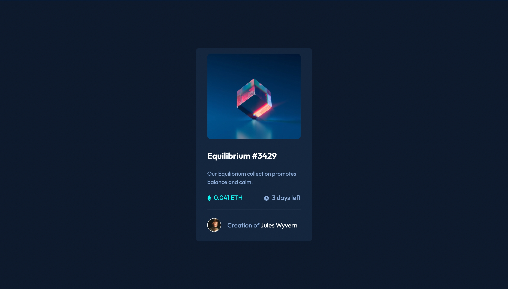
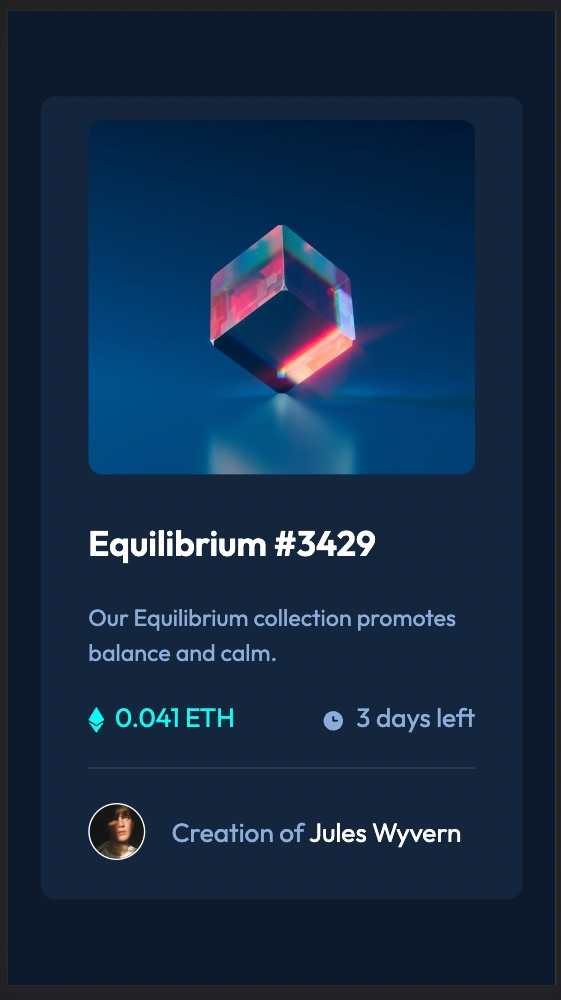

# Frontend Mentor - NFT preview card component solution

This is a solution to the [NFT preview card component challenge on Frontend Mentor](https://www.frontendmentor.io/challenges/nft-preview-card-component-SbdUL_w0U). Frontend Mentor challenges help you improve your coding skills by building realistic projects.

## Table of contents

- [Overview](#overview)
  - [The challenge](#the-challenge)
  - [Screenshot](#screenshot)
  - [Links](#links)
- [My process](#my-process)
  - [Built with](#built-with)
  - [What I learned](#what-i-learned)
  - [Continued development](#continued-development)
- [Author](#author)

## Overview

### The challenge

Users should be able to:

- View the optimal layout depending on their device's screen size
- See hover states for interactive elements

### Screenshot

#### Desktop design screenshot

#### Mobile design screenshot

### Links

- Solution URL: [NFT preview card component challenge on GitHub](https://github.com/alvyynm/frontendmentor-challenges/tree/main/02-nft-preview-card-component)
- Live Site URL: [Add live site URL here](https://alvyynm.github.io/nft-component-design/)

## My process

### Built with

- Semantic HTML5 markup
- CSS custom properties
- Flexbox
- Mobile-first workflow

### What I learned

My main takeaway from this project was the importance of mobile-first workflow. It helped me save time. Since the design is identical on mobile and desktop, all I had to do was design the mobile site, and voila!

The second takeaway is how to use overlay effects

### Continued development

Here are the main areas I plan to improve on:

- Mobile-first workflow
- Planning for the structure ahead of time
- Aligning images inside a div without overflow
- Using overlay effects
- Z-index

## Author

- Website - [Alvin Wanjala](https://alvyynm.github.io/personal-website/)
- Frontend Mentor - [@alvyynm](https://www.frontendmentor.io/profile/yourusername)
- Twitter - [@alvyynm](https://www.twitter.com/alvyynm)
