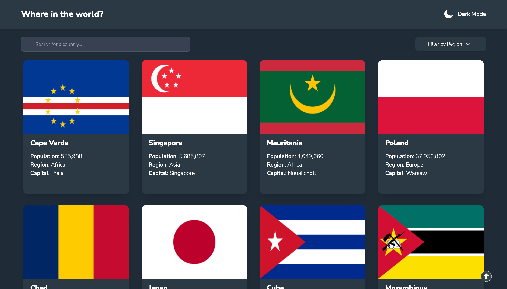

# Frontend Mentor - REST Countries API with color theme switcher solution

This is a solution to the [REST Countries API with color theme switcher challenge on Frontend Mentor](https://www.frontendmentor.io/challenges/rest-countries-api-with-color-theme-switcher-5cacc469fec04111f7b848ca). Frontend Mentor challenges help you improve your coding skills by building realistic projects.

## Table of contents

- [Overview](#overview)
  - [The challenge](#the-challenge)
  - [Screenshot](#screenshot)
  - [Links](#links)
- [My process](#my-process)
  - [Built with](#built-with)
  - [What I learned](#what-i-learned)
  - [Continued development](#continued-development)

## Overview

### The challenge

Users should be able to:

- ✅ See all countries from the API on the homepage
- ✅ Search for a country using an `input` field
- ✅ Filter countries by region
- ✅ Click on a country to see more detailed information on a separate page
- ✅ Click through to the border countries on the detail page
- ✅ Toggle the color scheme between light and dark mode _(optional)_

### Screenshot



### Links

- [GitHub](https://github.com/alvyynm/frontendmentor-challenges/tree/main/12-rest-countries-api)
- [Live site](https://your-live-site-url.com)

## My process

### Built with

- [React](https://reactjs.org/) - JS library
- Context API
- [React router v6](https://reactrouter.com/en/main) - routing
- [Tailwind css](https://tailwindcss.com/)
- [axios](https://axios-http.com/) - used to make API calls
- [uuid npm package](https://www.npmjs.com/package/uuid) - creating unique ids for each country
- [uiball](https://uiball.com/) - loading animation
- [undraw](https://undraw.co/) - illustrations for error pages
- Mobile-first workflow

### What I learned 😊

I learnt alot building this project. Some of the key lessons include:

- Reading values from a list of objects with variable keys:

```js
const currencies = Object.values(countryDetails?.currencies);
```

- Handling errors in API response data

```js
currencies === undefined
  ? "Not provided"
  : currencies.map((value) => value.name).join(" , ");
```

- Having a fallback page when the API request fails

```js
// state for api error
const [apiError, setApiError] = useState(null);

// fetching data using axios
axios
  .get(`https://restcountries.com/v3.1/name/${countryName}`)
  .then((response) => {
    setCountryDetails(response.data[0]);
  })
  .catch((error) => {
    setApiError(error);
  });

// display fallback page if api throws an error, otherwise display normal page
apiError ? <Fallback /> : <Expectedpage />;
```

To see how you can add code snippets, see below:

### Continued development 🛣️🚶🏿‍♂️

The key areas I'd like to improve after this project include:

- working with APIs
- prioritizing error handling earlier on
